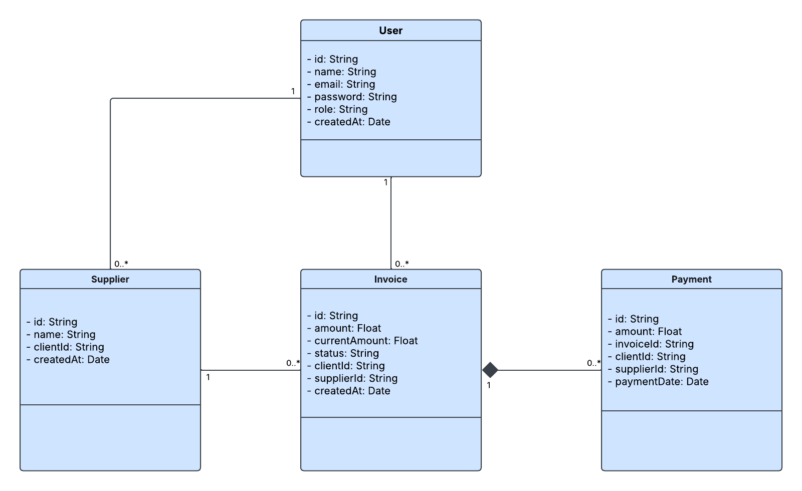
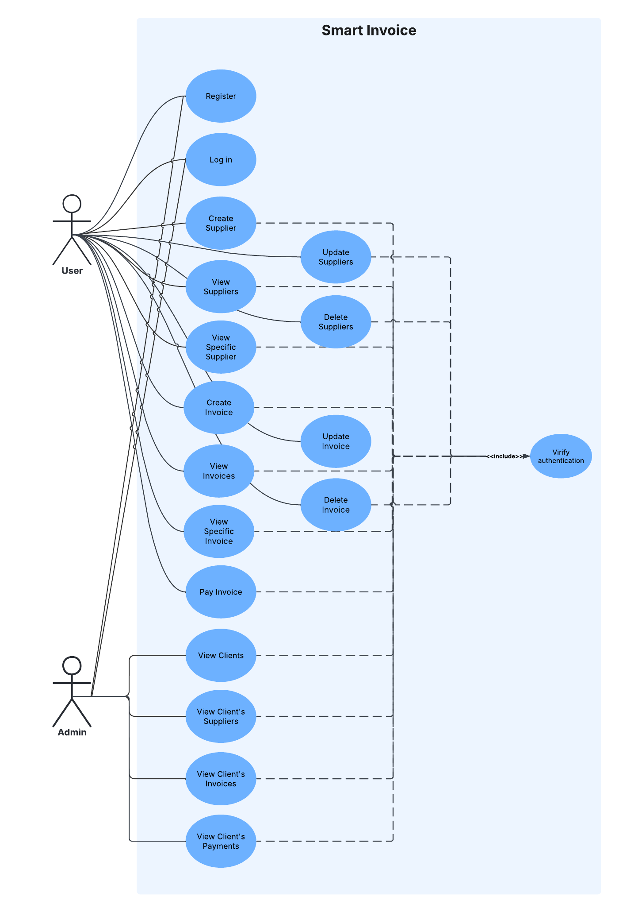

# Smart Invoice API

In the day-to-day operations of businesses and freelancers, managing supplier invoices quickly becomes complex. It's often difficult to track spending, identify pending or overdue invoices, and gain a clear understanding of supplier relationships.

**Smart Invoice** is a secure backend RESTful API designed to help users manage their list of suppliers, record and track received invoices, and handle partial or full payments while maintaining strict data isolation.

## 🚀 Features

-   **Secure Authentication**: JWT-based registration and login system.
-   **Supplier Management**: Complete CRUD operations for managing business partners.
-   **Invoice Tracking**: Automatic status tracking (unpaid, partially paid, paid) and due date management.
-   **Payment Processing**: Record full or partial payments with validation against the total invoice amount.
-   **Data Isolation**: Multi-tenant architecture ensuring clients only access their own data.
-   **Analytics & Dashboard**: Real-time statistics per supplier and overall financial overview.
-   **Admin Oversight**: Dedicated administrative routes to monitor platform-wide activity.

## UML Diagrams

### UML Class Diagram

### UML Use Case Diagram

## 🛠️ Tech Stack

-   **Runtime**: Node.js
-   **Framework**: Express.js
-   **Database**: MongoDB (with Mongoose)
-   **Security**: JSON Web Tokens (JWT), Bcrypt, and Middleware-based Authorization

## 🏗️ Architecture & Constraints

-   A **Supplier** belongs to a single customer.
-   An **Invoice** belongs to only one customer and one supplier.
-   **Invoice Statuses**:
    -   `unpaid`: No payments recorded.
    -   `partially_paid`: Partial payment received (total < invoice amount).
    -   `paid`: Total payments equal the invoice amount.
-   **Rules**:
    -   Invoices can only be modified if they are not fully paid.
    -   Invoices can only be deleted if no payments are associated with them.

## 🛣️ API Endpoints

### Authentication

| Method | Endpoint             | Description                    |
| :----- | :------------------- | :----------------------------- |
| POST   | `/api/auth/register` | Register a new client          |
| POST   | `/api/auth/login`    | Login and obtain JWT token     |
| GET    | `/api/auth/me`       | Retrieve authenticated profile |

### Supplier Management

| Method | Endpoint             | Description              |
| :----- | :------------------- | :----------------------- |
| POST   | `/api/suppliers`     | Create a new supplier    |
| GET    | `/api/suppliers`     | List all your suppliers  |
| GET    | `/api/suppliers/:id` | View a specific supplier |
| PUT    | `/api/suppliers/:id` | Modify a supplier        |
| DELETE | `/api/suppliers/:id` | Delete a supplier        |

### Invoice Management

| Method | Endpoint            | Description                                     |
| :----- | :------------------ | :---------------------------------------------- |
| POST   | `/api/invoices`     | Create an invoice (supplierId, amount, dueDate) |
| GET    | `/api/invoices`     | List all your invoices (with filters)           |
| GET    | `/api/invoices/:id` | View a specific invoice                         |
| PUT    | `/api/invoices/:id` | Modify an invoice (if not fully paid)           |
| DELETE | `/api/invoices/:id` | Delete an invoice (if no payment associated)    |

### Payment Management

| Method | Endpoint                     | Description                            |
| :----- | :--------------------------- | :------------------------------------- |
| POST   | `/api/invoices/:id/payments` | Record a payment (amount, paymentDate) |
| GET    | `/api/invoices/:id/payments` | List the payments for an invoice       |

### Monitoring & Analysis

| Method | Endpoint                   | Description                                      |
| :----- | :------------------------- | :----------------------------------------------- |
| GET    | `/api/suppliers/:id/stats` | Statistics for a supplier (invoices, amounts, %) |
| GET    | `/api/dashboard`           | Overview (total invoices, expenses, delays)      |

### Admin Routes (Protected)

| Method | Endpoint                           | Description                 |
| :----- | :--------------------------------- | :-------------------------- |
| GET    | `/api/admin/clients`               | List all registered clients |
| GET    | `/api/admin/clients/:id/suppliers` | View a client's suppliers   |
| GET    | `/api/admin/clients/:id/invoices`  | View a client's invoices    |
